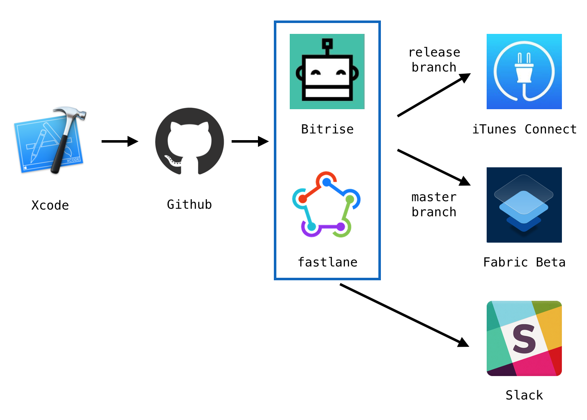

# YourIDFA

[](https://www.bitrise.io/app/196577456afab774)
[](https://github.com/naoto0822/your-idfa-ios/releases)
[](https://github.com/naoto0822/your-idfa-ios/issues)
[](https://github.com/naoto0822/your-idfa-ios/blob/master/LICENSE)

You can confirm IDFA/Optout of this device installed YourIDFA.


## App Store

[Store link](https://itunes.apple.com/jp/app/youridfa/id1142232722?mt=8)

## Getting Started

1. clone this repository.

 ```sh
 $ git clone https://github.com/naoto0822/your-gaid-android.git
 ```

2. setup Gem. (after setting `bundler`)

 ```sh
 $ bundle install
 ```

3. bootstrap. (exec `pod install`, `git submodule ~`, `fastlane match` commands)

 ```sh
 $ bundle exec fastlane ios bootstrap
 ```

4. open Xcode project.

 ```sh
 $ open `YourIDFA.xcworkspace`
 ```

> run following command when register new device.

```
$ fastlane match --force_for_new_devices deveopment
```

## CI/CD

`YourIDFA.ipa` will be uploaded to iTunesConnect automatically,  
when merged into the release branch.

using [Bitrise](https://www.bitrise.io), [fastlane](https://fastlane.tools/).




## OSS

- [Material](https://github.com/CosmicMind/Material)
- [CocoaPods](https://cocoapods.org/)
- [fastlane](https://github.com/fastlane/fastlane)

## 3rd Party SDK

#### Analytics

- [Firebase](https://firebase.google.com/ "Firebase")

#### Crash

- [Fabric](https://fabric.io, "Fabric")

#### Tracker

- [MobileInsight](https://ymi.yahoo.co.jp/)

## TODO

- [ ] setting SwiftLint

## License

```
Copyright 2017 Naoto Yamaguchi

Licensed under the Apache License, Version 2.0 (the "License");
you may not use this file except in compliance with the License.
You may obtain a copy of the License at

   http://www.apache.org/licenses/LICENSE-2.0

Unless required by applicable law or agreed to in writing, software
distributed under the License is distributed on an "AS IS" BASIS,
WITHOUT WARRANTIES OR CONDITIONS OF ANY KIND, either express or implied.
See the License for the specific language governing permissions and
limitations under the License.
```
